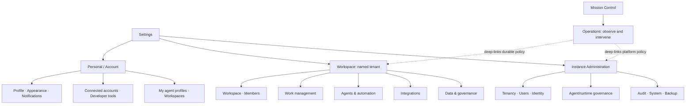

# Forge settings information architecture review

Date: 2026-07-14
Status: screenshot-backed audit complete; first implementation slice in progress
Scope: Instance Admin, cross-workspace Mission Control/global settings, per-workspace settings

## Executive decision

Forge should keep its three ownership levels, but present them as one settings system with an explicit scope switcher:

1. **Personal** — follows the signed-in person across workspaces.
2. **Workspace** — affects members and work inside one named workspace.
3. **Instance** — affects every workspace and is visible only to instance administrators.

Mission Control should not be a fourth settings scope. It should remain the cross-workspace operating home. The floating in-workspace panel should be called **Activity**, and its gear should open **Activity preferences**.

The recommended first implementation slice is navigation and naming, not a route rewrite: add a shared scope header and settings overview, fix the two functional dead ends, rename conflicting entries, and preserve the existing URLs behind the new structure.

## Evidence and audit limit

The audit used fresh captures from the seeded running product after explicit
approval to use Playwright CLI. Accepted evidence covers Mission Control,
Personal/global settings, named-workspace settings, Instance Admin, ambiguous
agent/runtime/client surfaces, and the floating operations preferences at
1440×900 and 390×844. Every accepted image was opened and inspected at original
resolution; three obstructed or incorrectly framed states were rejected and
recaptured.

The strongest visible evidence is:

- `09-authentication-in-account-shell-desktop.png`: an explicitly
  instance-wide, instance-admin-only control inside the Account shell.
- `17-developer-access-in-account-shell-desktop.png`: workspace API keys inside
  that same Account shell, with no named-workspace scope label.
- `06-dispatch-fall-through-desktop.png`: a read-only mode that instructs the
  user to visit a Workspace control that does not exist.
- `10-instance-admin-overview-desktop.png`: the clearest existing pattern—scope,
  audience, and blast radius are persistent.
- `13-workspace-settings-overview-mobile.png` and
  `15-instance-admin-overview-mobile.png`: navigation consumes a large top
  region and data surfaces overflow/crowd before the primary task begins.

Capture log and full evidence index: [screenshots/README.md](screenshots/README.md)

The evidence supports visible hierarchy, naming, reflow, density, and
obstruction findings. It does not by itself prove screen-reader output,
contrast ratios, or every permission path. Those remain covered by DOM/axe,
keyboard, and role-specific tests in the implementation phase. Figma and Orca
were not used.

## User goal and target

An operator should be able to answer these questions before changing anything:

- Who will this setting affect: me, this workspace, or the whole Forge instance?
- Do I have permission to change it?
- Where do I go back to after saving it?
- Is this a definition, a workspace binding, or an instance policy?
- If a setting inherits a broader default, what is the effective value here?

The target is a keyboard-accessible, responsive settings experience with explicit scope, predictable navigation, role-aware editability, and no duplicate names for different concepts.

## Current architecture inventory

### 1. Mission Control and global shell

| Surface | Route | Actual responsibility | Current issue |
|---|---|---|---|
| Mission Control home | `/` | Cross-workspace read-only operating overview | Correct responsibility, but shares its name with the in-workspace floating panel. |
| Global inbox | `/inbox` | Cross-workspace mentions and assignments | Operational, not configuration. |
| Global activity | `/activity` | Cross-workspace live run feed | The intended name for activity already exists, while the floating activity panel is still called Mission Control. |
| Global Settings entry | `/settings/agents` | Opens global agent profiles | There is no global settings overview; “Settings” unexpectedly starts with Agents. |
| Floating “Mission Control” | mounted in each workspace | Live, queue, agents, chat, sound, and default-tab preference | Duplicates the name of `/`; its generic gear looks like another app settings entry. |

Code anchors:

- `src/components/global-shell/global-shell.tsx:112-116` names `/` Mission Control and `/activity` Activity.
- `src/components/global-shell/global-shell.tsx:277-286` sends the global Settings entry directly to `/settings/agents`.
- `src/components/mission-control/mission-control.tsx:622-705` still labels the floating panel and collapse action “Mission Control.”
- `src/components/mission-control/settings-popover.tsx:34-143` mixes browser-local sound with per-user and per-workspace default-tab preferences.

### 2. Personal and cross-workspace settings

The bare `/settings/*` rail contains nine entries in one group labeled **Account**, even though they have four different ownership and permission models.

| Current label | Route | Real scope / owner | Recommended label and home |
|---|---|---|---|
| Agents | `/settings/agents` | User-owned profile definitions; creation/approval is instance-admin governed | **My agent profiles** under Personal; approval/share/disable under Instance → Agent governance |
| Agent Clients | `/settings/clients` | User-owned MCP sessions and keys | **Developer clients** under Personal → Developer tools |
| Runtimes | `/settings/runtimes` | Cross-workspace inventory of user-owned hosts, but mutation is workspace-scoped | **Runtime inventory** under Operations, with a canonical detail route |
| Connections | `/settings/connections` | User-owned OAuth identities | **Connected accounts** under Personal → Integrations |
| Profile | `/settings/account` | User profile, regional preferences, theme, Pomodoro | **Profile & regional** under Personal |
| Appearance | `/settings/appearance` | User UI preferences | **Appearance** under Personal |
| Developer access | `/settings/access` | Workspace API keys plus external-agent setup presented in a global shell | Split into **Personal tokens** and **Workspace API access** based on the key's real scope |
| Authentication | `/settings/auth` | Whole-instance sign-in providers, instance-admin-only | Move to **Instance → Identity & sign-in** |
| Workspaces | `/settings/workspaces` | Workspace directory, creation, switching, archive/delete | **Workspaces** as a global directory; keep creation policy explicit |

Key structural problems:

- Instance-wide authentication appears inside a rail labeled “Account” (`src/components/settings/settings-nav.ts:202-240`).
- Global resources are prepended to that same Account group without subgroups (`src/components/settings/settings-rail.tsx:193-249`).
- The account settings shell always returns to Mission Control, even when entered from a workspace (`src/app/(app)/settings/layout.tsx:5-30`).
- Workspace-scoped redirect stubs erase the originating workspace and return context.

### 3. Workspace settings

The workspace settings inventory is coherent at the route level, but the grouping and permission language are inconsistent.

| Group | Current entries | Actual responsibility | Recommendation |
|---|---|---|---|
| Workspace | General, Members | Workspace identity, cadence, storage, issue defaults, agent SLA, budgets, lifecycle, AI, danger zone; member access | Split the overloaded General page into Workspace profile, Issue lifecycle, Reliability & safety, and AI & triage. |
| Workflow | Statuses, Labels, Templates, Saved views, Recurring | Issue planning configuration | Rename group **Work management**; show “Read only” or “Admin” based on the caller's role. |
| Automation | Agents, Dispatch rules | Agent bindings, per-workspace policy, routing, engagement modes | Rename **Agents & automation**; add Dispatch & routing and make the effective fall-through mode editable. |
| Connections | Connections, GitHub Apps, Plugins, Webhook deliveries | OAuth mappings, runtime GitHub auth, extensions, outbound delivery queue | Rename **Integrations** and distinguish Connected account, Mapping, GitHub runtime access, and Webhook delivery. |
| Admin | Admin portal, Data import/export | Workspace audit/events/deliveries and portability | Rename **Data & governance**; “Admin portal” is too easily confused with Instance Admin. |

The workspace overview then appends the Account group directly beneath workspace groups (`src/app/(app)/w/[slug]/settings/page.tsx:54-74`). That creates a scope jump without a scope control. A person can click Appearance while inside AXI settings and land in a different shell whose only back link is Mission Control.

The General page is also too broad. It combines at least these concepts:

- identity and danger zone;
- sprint cadence;
- time tracking and attachment quota;
- default issue assignee;
- agent liveness, acknowledgements, SLA and review timeouts;
- token, cost and time budgets;
- assignment, review and completion transitions;
- completion automation;
- AI provider and Coach behavior.

This makes “General” a catch-all rather than a useful destination.

### 4. Instance Admin

| Route | Current label | Responsibility | Recommended label / placement |
|---|---|---|---|
| `/admin` | Overview | Instance health and totals | Keep **Overview** |
| `/admin/tenants` | Workspaces | All tenants | Keep **Workspaces** |
| `/admin/move-issues` | Move issues | Cross-workspace data operation | Place under **Workspaces → Move data** or **Data operations** |
| `/admin/users` | Users | Users and instance roles | **Users & roles** |
| `/admin/agents` | Agent policy | Share, disable, approve global profiles | **Agent governance** |
| `/admin/runtimes` | Runtimes | Instance-wide runtime inventory/policy | **Runtime governance** |
| `/admin/audit` | Audit log | Cross-workspace audit | Keep **Audit log** |
| `/admin/system` | System | Build and instance totals | **System & backup** once backup is functional |

Instance Admin is the clearest of the three current shells because it has a persistent instance-scope warning and a distinct visual tone. Preserve that safety signal inside the unified settings frame. The main gap is that instance configuration is split: sign-in providers live in Account settings, while users, agents, runtimes, audit, and system live under `/admin`.

## Complete control-surface mapping

Frequency uses **H/M/L** for high/medium/low; risk uses **L/M/H/C** for low,
medium, high, or critical blast radius. “Source” names the authoritative value
or inheritance chain. “Entry/duplication” records current discoverability and
conflicts.

### Personal, account, and cross-workspace resources

| Route / controls | Authoritative scope | Audience | Freq / risk | Prerequisite | Effective value / source | Current entry / duplication |
|---|---|---|---|---|---|---|
| `/settings` | Personal | Any signed-in user | H / L | Session | None; route absent | Global Settings jumps to Agents; no overview. |
| `/settings/account` — profile, timezone, locale, time format, theme, Pomodoro | Personal | Signed-in user | L / L | Session | `User` preferences | Account rail; theme overlaps Appearance. |
| `/settings/appearance` — theme, density, text size, motion, background | Personal | Signed-in user | L / L | Session | `User`; applied by `AppearanceProvider` | Account rail; theme duplicated in Profile. |
| `/settings/connections` — OAuth identities | Personal identity | Connection owner | L / M | Provider client configured | `UserConnection`; workspace mappings consume it | “Connections” also names a workspace mapping surface. |
| `/settings/agents` + detail — profile definitions | User-owned definition with instance governance | Owners; instance admin for create/share/disable | M / H | Provider/runtime as applicable | `AgentProfile` plus instance sharing/disabled policy | “Agents” also means roster and governance. |
| `/settings/runtimes` — owned inventory, health, detail hop | User-owned inventory; current mutation/details remain workspace-bound | Runtime owner/operator | M / H | Registered runtime and home workspace | Runtime home workspace + health signals | “Global to your account” copy conflicts with workspace authorization; detail can use wrong workspace. |
| `/settings/workspaces` — create, rename, switch, archive | Cross-workspace directory; writes affect a workspace | Members/admins | M / H | Membership; admin for destructive writes | `Workspace` + `WorkspaceMember` | Correctly global to discovery, but archive ownership is tenant scope. |
| `/settings/access` — agent, personal, session API keys; scopes/context/expiry/rotate/revoke | **Workspace** (`ApiKey.workspaceId`) despite Account shell | Workspace admins/developers | M / C | Implicit last-workspace cookie | Explicit key scopes + project/label/initiative narrowing; no broader inheritance | Account rail hides named workspace; duplicated by Agent Clients. |
| `/settings/clients` — derived MCP clients and revocation | **Workspace**, derived from workspace keys | Workspace admins/developers | M / H | Implicit last-workspace cookie | Same `ApiKey` rows as Developer access | Account rail; duplicates access inventory/actions. |
| `/settings/auth` — OIDC/GitHub/Google providers, discovery, enable/disable/delete | **Instance** | Instance admin | L / C | Instance-admin role; provider credentials | `SsoProvider`; email/password fallback | Account rail beside personal preferences; missing from Instance nav. |
| Personal notifications (router/schema only) | Personal default with workspace override | Signed-in user | M / L | Notification capability | `UserNotificationPreference` + membership override | No durable settings page; some preferences leak into Activity popover. |

### Mission Control as Operations

| Surface / controls | Authoritative scope | Audience | Freq / risk | Prerequisite | Effective value / source | Current entry / duplication |
|---|---|---|---|---|---|---|
| `/` — global Mission Control overview | Cross-workspace read-only operations | Operators/members | H / L | One or more memberships | Aggregated runs, queues, agents, runtimes, activity | Global home; correct operational responsibility. |
| `/activity` | Cross-workspace activity operations | Operators | H / L | Membership | Activity/event stream | Name collides conceptually with workspace dock currently called Mission Control. |
| `/w/:slug/command-center` | Workspace intervention | Workspace operators/admins | H / H | Workspace membership; action-specific permission | Live runs, approvals, recoveries, incidents | Durable home for operational intervention. |
| Floating “Mission Control” — Live, Queue, Agents, Chat | Workspace quick operations | Workspace members/operators | H / M | Workspace context | Live workspace state; durable actions deep-link elsewhere | Duplicates global product name and sidebar entry. |
| Floating gear — sound, global default tab, workspace default tab | Local browser + Personal + Workspace override | Signed-in user | L / L | Workspace context | localStorage sound; `User` default; membership override; effective override shown | Three scopes mixed in one unlabeled popover; generic Settings name. |

### Named Workspace settings

| Route / controls | Authoritative scope | Audience | Freq / risk | Prerequisite | Effective value / source | Current entry / duplication |
|---|---|---|---|---|---|---|
| `/w/:slug/settings` — overview | Workspace index plus cross-scope Account links | Members | M / L | Membership | Nav catalog only | Sidebar Settings; repeats full rail and introduces unannounced Account scope jump. |
| `/workspace` — identity/avatar, sprint cadence/cooldown, time/storage, default assignee, liveness/SLA/ack/review, budgets, lifecycle, completion, AI, danger | Workspace | Mostly workspace admins | L / C | Admin role; status/member/provider prerequisites by control | `Workspace` columns; many `0`/`null` sentinel defaults; project completion may override | “General” catch-all; no inheritance summary; destructive controls buried at bottom. |
| `/members` — invite, roles, remove | Workspace access policy | Workspace admins | M / C | Admin role | `WorkspaceMember` | Marked admin-only; no global user-role cross-link. |
| `/statuses` — pipeline states/categories/order | Workspace workflow | Admins/editors as router permits | L / H | Existing default statuses | Workspace statuses; issue status resolves directly | Workflow nav; permission badge absent. |
| `/labels` — create/rename/recolor/delete | Workspace workflow | Admins/editors as router permits | M / M | Membership | Workspace labels | Workflow nav. |
| `/templates` — issue/project templates | Workspace work management | Workspace members/admins | M / M | Relevant statuses/projects | Workspace template rows | “Templates” aliases old project-template redirect. |
| `/views` — personal/shared saved views | Mixed Personal or Workspace sharing | Members | M / M | Membership | Owner plus shared flag | Listed only under Workspace without personal/shared scope signal. |
| `/recurring` — cadence and auto-create | Workspace automation | Workspace admins/operators | M / H | Template/workflow targets | Recurring rule rows | Under Workflow despite automation behavior. |
| `/agents` — bind profile, runtime/provider, capability/capacity/eligibility, approval/start policy | Workspace binding | Workspace admins/operators; members read | M / H | Available profile; optional runtime/connection | Profile definition → binding override → instance policy | Strongest existing explanation; generic “Agents” duplicates two other scopes. |
| `/dispatch-rules` — ordered matching rules, engagement defaults, mention policy, fall-through | Workspace automation policy | Workspace admins/operators | H / H | Bound eligible agents; labels/projects for conditions | First matching rule, then `Workspace.autoDispatchMode` | Fall-through read-only and points to nonexistent control; settings split from General. |
| `/connections` — provider mapping, GitHub status repair/reconciliation defaults | Workspace integration mapping/policy | Workspace admins | M / H | Personal OAuth identity and repository access | `Connection` mapping + workspace reconciliation defaults | Generic “Connections” duplicates Personal identities. |
| `/github-apps` — shared App credentials/install state for runtime tokens | Workspace integration/runtime access | Workspace admins | L / C | GitHub App and installation | Workspace GitHub App config | Ambiguous between instance credential, workspace mapping, and runtime prerequisite. |
| `/plugins` + detail — install/approve/suspend/scopes | Workspace extensions | Workspace admins | L / C | Plugin manifest and declared scopes | Manifest ceiling + issued key scopes | No instance default/allowlist is visible. |
| `/deliveries` — queue, failures, DLQ, requeue | Workspace operational diagnostics | Workspace admins/operators | M / H | Webhooks/plugins configured | Durable `WebhookDelivery` rows | Operational surface under settings; should deep-link from Operations and retain canonical diagnostics home. |
| `/admin` — audit, activity, delivery observability | Workspace governance/operations | Workspace admins | M / H | Admin role | Workspace audit/activity/delivery data | “Admin portal” easily confused with Instance Admin. |
| `/data` — export/import | Workspace data governance | Workspace admins | L / C | Admin role; valid snapshot for import | Workspace snapshot schema | Admin group; archive/delete remain in General. |
| `/runtimes` + detail (not in rail) — runtime secrets/self-test/config | Runtime home workspace | Workspace admins/runtime operators | M / C | Runtime belongs to current workspace | Runtime row scoped by `workspaceId` | Hidden from workspace nav while global inventory deep-links here. |

### Instance Administration

| Route / controls | Authoritative scope | Audience | Freq / risk | Prerequisite | Effective value / source | Current entry / duplication |
|---|---|---|---|---|---|---|
| `/admin` — health, license, tenant/user/run/runtime totals, events | Instance | Instance admin | H / L | Instance-admin role | Cross-tenant aggregates/build metadata | Strong persistent Instance scope warning. |
| `/admin/tenants` — tenant inventory/create | Instance tenancy | Instance admin | M / C | Instance-admin role | All `Workspace` rows | “Workspaces” overlaps personal directory but authority is clear in admin shell. |
| `/admin/move-issues` — cross-workspace move | Instance data operation | Instance admin | L / C | Source/target workspace and compatible mappings | Explicit move input; no inheritance | Separate top-level item despite tenancy relationship. |
| `/admin/users` — users and instance roles | Instance access | Instance admin | M / C | Instance-admin role | `User` role + memberships | Should name roles explicitly. |
| `/admin/agents` — share/unshare/disable/remove profiles | Instance agent governance | Instance admin | M / C | Existing profile | Profile owner definition + instance shared/disabled policy | Correct authority; generic “Agent policy” underspecifies governance. |
| `/admin/runtimes` — inventory, health, instance actions | Instance runtime governance | Instance admin/operator | M / C | Registered runtimes | Cross-workspace runtime view + instance policy | Relationship to personal inventory and workspace detail is not cross-linked. |
| `/admin/audit` | Instance audit/security | Instance admin/security | H / H | Instance-admin role | Cross-tenant audit log | Correct scope; search/export affordances limited. |
| `/admin/system` — version/build/regions/totals | Instance infrastructure | Instance admin/operator | M / H | Instance-admin role | Build/runtime environment | “System & backup” implied by overview CTA but backup readiness is not authoritative here. |
| `/admin/auth` (target; absent initially) | Instance identity & sign-in | Instance admin/security | L / C | Instance-admin role + provider credentials | `SsoProvider` | Authoritative page missing; existing control lives at `/settings/auth`. |

## What is working

- The data model already distinguishes user, workspace/binding, and instance policy. The IA can align to real ownership instead of inventing new concepts.
- Workspace settings navigation and the workspace overview share one source of truth, preventing simple inventory drift.
- The account rail has search and a `/` shortcut.
- Workspace agent copy already teaches the useful **definition → binding → instance policy** model.
- The Instance Admin shell visibly warns that writes affect every tenant.
- Old workspace account routes redirect, reducing broken bookmarks during migration.

## Numbered walkthrough health report

These labels combine the inspected screenshots with route, permission, and
data-model evidence.

1. **Mission Control → Settings — at risk.** Screenshot 01 shows a clear global
   home, but the persistent Settings entry opens Agent profiles instead of an
   overview. Screenshot 12 exposes a second generic gear inside another surface
   also called Mission Control.
2. **Personal/global settings — poor.** Screenshots 02, 09, 17, and 18 show
   personal definitions, instance SSO, and workspace API keys in one Account
   rail. Scope cannot be determined from the shell.
3. **Workspace settings overview — mixed.** Screenshot 04 shows a useful grouped
   index and shared navigation source, but repeats the rail and later appends
   Account destinations. Screenshot 13 shows that mobile users spend roughly
   the first third of the viewport traversing a separately scrolling rail.
4. **Agent, Runtime, and Connection configuration — mixed.** Screenshot 07
   provides the best explanatory model—definition → binding → instance policy.
   Screenshots 02, 03, 08, 11, and 17 show that the same nouns elsewhere omit
   that qualifier. The global runtime detail hop may authorize against the wrong
   workspace, and its four-column telemetry visibly collides at desktop width.
5. **Instance Admin — generally healthy, with one serious split.** Screenshots
   10 and 11 make scope, audience, and destructive authority obvious. Screenshot
   09 proves that sign-in provider configuration is stranded outside it.
6. **Switching scope and returning — poor.** There is no scope switcher, account
   settings always returns to Mission Control, and the originating workspace is
   lost.
7. **Mobile and responsive behavior — poor.** Screenshots 13–16 confirm capped
   nested navigation, crowded/clipped admin tables, and an operations shelf that
   covers nearly the full workspace. The Activity preferences popover itself
   reflows within 390px, but it obscures its parent and has no dialog semantics.
8. **Keyboard and assistive technology — at risk.** Visible focus styles and
   several shortcuts are strengths. Search lacks a programmatic label, active
   nav links lack `aria-current`, and the Activity preferences popover lacks
   Escape/focus-return semantics. Screenshot evidence alone cannot certify
   screen-reader behavior or contrast.

## Highest-impact findings

### P0 — functional and safety gaps

1. **Auto-dispatch fall-through cannot be changed from the UI it points to.**  
   Dispatch Rules renders the current `autoDispatchMode` read-only and tells the operator to change it under Settings → Workspace (`dispatch-rules/page.tsx:670-710`). `workspace.update` does not accept `autoDispatchMode` (`workspace.ts:273-314`), and the Workspace page has no control for it. This is a functional dead end. Put the editable master toggle and mode in **Workspace → Agents & automation → Dispatch & routing**.

2. **A global runtime card can link to a workspace where its detail is guaranteed to 404.**  
   The global inventory prefers `workspacesInUse[0]` over the runtime's home workspace (`settings/runtimes/page.tsx:125-155`), while `runtime.byId` requires `Runtime.workspaceId === ctx.workspaceId` (`runtime.ts:208-230`). Create `/settings/runtimes/[id]` with owner/admin authorization, or always link to `homeWorkspace` until Runtime is truly globalized.

3. **Instance-wide authentication is presented as personal Account configuration.**  
   A high-impact write that changes sign-in for every tenant should not sit beside theme and Pomodoro. Move the route into the Instance scope and preserve `/settings/auth` as an instance-admin redirect.

4. **The UI does not consistently expose effective scope before a write.**  
   The workspace overview mixes workspace and account destinations, while account settings drops workspace context. Add an always-visible scope chip/switcher and a page-level “Affects …” line before expanding functionality.

### P1 — navigation, naming, and missing controls

1. **Mission Control names two different products.** Keep Mission Control for `/`; rename the in-workspace panel and its actions to Activity / Activity preferences. This also completes the intent recorded in `docs/plans/multiws-restructure.md`.
2. **Global Settings starts on Agents.** Add `/settings` as a Personal settings overview or redirect to `/settings/account`; never make an operational resource the implicit settings home.
3. **The account rail is not actually an Account group.** Break it into Personal, Developer tools, and Cross-workspace resources; render Instance as a separate scope for authorized users.
4. **Notification preferences exist in the router and schema but have no UI.** Add Personal → Notifications with global defaults and workspace overrides. Fold Activity sound/default-tab preferences into it, while retaining a quick popover shortcut.
5. **Workspace General is overloaded.** Split lifecycle, reliability/safety, and AI into named pages. Keep identity/cadence/storage/default assignee in Workspace profile.
6. **The same nouns mean different levels.** Use Agent profiles / Workspace agent roster / Agent governance; Runtime inventory / Workspace runtime access / Runtime governance; Connected accounts / Integration mappings.
7. **Admin badges understate edit restrictions.** Many workspace settings use `adminProcedure`, but the rail marks only Members, Webhook deliveries, Admin portal, and Data as admin-only. Show effective access consistently: Admin, Read only, or Personal.
8. **Project completion policy is a hidden lower-scope override.** Project edit supports inherit/off/recommend/auto, but the settings system has no inheritance map. Workspace lifecycle settings should link to projects with overrides and show the effective resolution chain.

### P2 — polish and resilience

1. Add settings search keywords and synonyms, not just label/description substring matching.
2. Preserve a `returnTo` context when crossing scopes so Back returns to the originating workspace.
3. Add route breadcrumbs that include scope: `Settings / AXI / Dispatch & routing`.
4. Put destructive workspace actions in a separate Danger zone route or a collapsed final section with explicit workspace identity.
5. Replace remaining visually inconsistent native selects where the shared Combobox improves search/keyboard behavior, without sacrificing native semantics.
6. Show inherited values inline: `Workspace default: Recommend`, `Project override: Auto when safe`, `Effective: Auto when safe`.
7. Add a “Why can't I edit this?” permission explanation instead of discovering authorization only after submitting.

## Proposed settings hierarchy

### Shared settings frame

Every settings page should use the same structural frame:

- Header: **Settings**
- Scope control: **Personal · Workspace: AXI · Instance**
- Page breadcrumb: `Settings / Workspace: AXI / Dispatch & routing`
- Scope description: `Changes affect everyone in AXI.`
- Role state: `Workspace admin` or `Read only`
- Left rail: only the selected scope's groups
- Return link: preserve the surface from which settings was opened

The Instance option is omitted for non-instance-admins. Its selected state retains the distinct graphite tone and “affects every workspace” warning.

### Personal

1. **Profile & regional** — name, avatar, timezone, locale, time format.
2. **Appearance** — theme, density, text size, motion, background.
3. **Notifications** — browser push, event delivery matrix, Activity sound, global default Activity tab, workspace overrides.
4. **Connected accounts** — user OAuth identities.
5. **Developer tools**
   - Developer clients
   - Personal access tokens
   - MCP setup
6. **My agent profiles** — definitions owned/requested by the user.
7. **Workspaces** — directory, switch, create; workspace archive/delete remains in that workspace's scope.

### Workspace: {name}

1. **Workspace**
   - Overview — identity, cadence, time tracking, storage, issue defaults
   - Members & roles
2. **Work management**
   - Statuses
   - Labels
   - Templates
   - Saved views
   - Recurring issues
3. **Agents & automation**
   - Agent roster — bind profiles, capabilities, capacity, approval policy
   - Dispatch & routing — rules, master toggle, fall-through mode, assignment engagement
   - Issue lifecycle — assignment/start, review, completion recommendations and status mapping
   - Reliability & safety — no-ack, stale/quiet, SLA, review fallback, run budgets
   - AI & triage — provider, model, triage, Coach
4. **Integrations**
   - Integration mappings — repos/channels/webhooks mapped from connected accounts
   - GitHub runtime access — GitHub Apps used to mint runtime tokens
   - Plugins
   - Webhook delivery
5. **Data & governance**
   - Audit & activity
   - Import / export
   - Danger zone

### Instance

1. **Overview** — health, version, license, totals.
2. **Workspaces** — directory, creation policy, ownership, move data.
3. **Users & roles** — access and instance-admin role.
4. **Identity & sign-in** — OIDC, GitHub, Google providers.
5. **Agent governance** — requests, approvals, instance sharing, force-disable.
6. **Runtime governance** — instance-shared hosts, disable, ownership, health.
7. **Audit log** — cross-workspace events.
8. **System & backup** — build, regions, backup and restore readiness.

## Ownership rules for ambiguous resources

| Resource | Definition | Workspace use | Instance policy |
|---|---|---|---|
| Agent | Personal **Agent profile** | **Agent roster binding** with capability/capacity/engagement policy | **Agent governance** with approval/share/disable |
| Runtime | Owner-visible **Runtime inventory** | **Runtime access/config** only where the runtime is authorized | **Runtime governance** for instance sharing/disable |
| Connection | Personal **Connected account** | **Integration mapping** to repo/channel/webhook | Instance sign-in providers are separate and named **Identity & sign-in** |
| Completion | Workspace lifecycle default | Project-level override with explicit inheritance | No instance override |
| Notifications | Personal global default | Per-workspace override | Instance only configures delivery infrastructure, not personal choices |

## Move, rename, merge, and deprecate map

| Current surface | Action | Target / compatibility |
|---|---|---|
| Global Settings → `/settings/agents` | Move entry point | `/settings` overview; retain `/settings/agents`. |
| Account → Authentication | Move + rename | `/admin/auth` **Identity & sign-in**; `/settings/auth` server redirect for at least one release. |
| Account → Developer access / Agent Clients | Move workspace-bound rows | Canonical `/w/:slug/settings/access` and `/clients`; old routes resolve the last authorized workspace, preserve query strings, and redirect. Personal tokens may later split to `/settings/developer`. |
| Account → Agents | Rename | **My agent profiles**; route retained. |
| Account → Runtimes | Rename | **Runtime inventory**; route retained; detail always uses home workspace until a global detail exists. |
| Account → Connections | Rename | **Connected accounts**; route retained. |
| Workspace → General | Split progressively | **Workspace profile**, **Issue lifecycle**, **Reliability & safety**, **AI & triage**; keep `/workspace` as overview/alias during migration. |
| Workspace → Automation / Agents | Rename | **Agents & automation / Agent roster**; route retained. |
| Workspace → Dispatch rules | Merge controls + rename | **Dispatch & routing**, including master toggle and fall-through mode. |
| Workspace → Connections | Rename | **Integration mappings**; route retained. |
| Workspace → Admin portal | Rename | **Audit & activity** under Data & governance. |
| Floating Mission Control | Rename | **Activity**; gear becomes **Activity preferences**. `/` remains Mission Control. |
| Instance → Agent policy / Runtimes / Users | Rename | **Agent governance**, **Runtime governance**, **Users & roles**; routes retained. |

## Role-based visibility and editability

| Role | Personal | Workspace | Instance | Operations |
|---|---|---|---|---|
| Signed-in user | Own profile/preferences/connections; own agent definitions subject to governance | Only workspaces where a member | Hidden | Aggregates and workspace operations limited to memberships. |
| Workspace member | Same | Browse allowed surfaces; admin-gated pages visibly **Read only** or hidden when they reveal sensitive data | Hidden | Observe; interventions gated per action. |
| Workspace admin/owner | Same | Full tenant policy, access, integrations, data, and danger controls | Hidden unless separately instance admin | Observe and intervene; durable policy deep-links to named workspace settings. |
| Instance admin | Same | Only tenant rights granted by membership, except explicit cross-tenant admin tools | Full Instance nav; critical actions carry persistent blast-radius warning | Cross-tenant observe/intervene plus deep-links to Instance policy. |

Visibility is not authorization: route/procedure gates remain authoritative.
Hidden navigation reduces leakage; page headers explain read-only state before a
user reaches a control. A workspace member must never discover permission only
after submitting a form.

## Contextual deep-link and effective-value plan

- Operations cards link to the durable owner of a policy, not a duplicate
  editor: queue/routing → named Workspace Dispatch & routing; SSO incident →
  Instance Identity & sign-in; runtime health → authorized home-workspace detail
  or Instance governance.
- Cross-scope links carry `returnTo` only when it is an internal, validated
  relative Forge URL. The settings frame renders “Back to {origin}.”
- Agent links name the level explicitly: profile definition, workspace roster
  binding, or instance governance.
- Inherited controls render three lines when applicable: broader default,
  local override, and **Effective** value. `null`/`0` sentinel semantics are
  translated into human copy such as “Inherited” or “Unlimited.”
- Runtime, GitHub App, connection, and plugin prerequisites are linked inline
  before an unavailable control, with the missing authority named.
- Old URLs preserve deep links with server redirects and query strings. Route
  aliases remain for at least one release and are covered by E2E redirect tests;
  telemetry/log searches determine when they can be removed.

## Interaction and accessibility findings

The responsive findings below are screenshot-confirmed; semantic findings are
confirmed from the rendered component structure and require automated/manual
assistive-technology validation after implementation.

- Settings search uses placeholder text without a programmatic label (`settings-rail.tsx:87-100`). Add an accessible name.
- Active settings, global, workspace, and admin links do not expose `aria-current="page"`; color alone appears to carry active state.
- The Activity settings button has a `title` but no explicit `aria-label`, `aria-haspopup`, or `aria-expanded`.
- The Activity popover is a plain positioned `div`, not a menu/dialog; it has no Escape handler, focus management, or focus return.
- Mobile settings navigation is a persistent top region capped at 16rem (`settings-rail.tsx:73-74`) rather than a drawer. Screenshots 13 and 14 confirm that it obscures discovery and creates two scroll regions before content.
- Dense admin and settings rail links appear shorter than the recommended mobile touch target; verify actual rendered size.
- Admin/read-only state is inconsistently communicated. Keyboard and screen-reader users may reach controls that fail only after activation.
- Thirty-seven native `<select>` elements remain across settings surfaces. Native selects are not inherently inaccessible, but label association, error association, and consistent focus styling should be tested.
- Scope changes and mutations announce success mainly through toasts; verify live-region behavior and that errors are attached to their fields.
- Reduced-motion code exists, but persistent Activity and status animations must be checked with OS and in-app reduced-motion settings.

### Remaining browser validation

Desktop and mobile visual walkthroughs are complete. Before release, repeat the
changed flows at tablet (768×1024), 200% zoom, keyboard-only, and reduced-motion
settings, then exercise member/admin/instance-admin roles:

1. Open Mission Control and locate global Settings.
2. Open Personal settings and switch among profile, notifications, connected accounts, and developer tools.
3. Enter AXI Workspace settings from a workspace page and verify scope/return context.
4. Traverse Workspace profile, agent roster, dispatch, lifecycle, integrations, audit, and danger zone.
5. Cross from Connected accounts to an Integration mapping and back.
6. Cross from a global runtime card to its canonical detail.
7. Enter Instance settings, edit sign-in provider state, and verify the instance warning.
8. Switch scopes using keyboard only and verify focus placement/announcement.
9. Search settings with synonyms and no results.
10. Verify read-only/member and admin experiences separately.

## P0 / P1 / P2 implementation backlog

| Priority | Work item | Acceptance criteria |
|---|---|---|
| P0 | Canonicalize Instance Identity & sign-in | `/admin/auth` is gated by the admin layout; `/settings/auth` redirects; Account nav has no SSO controls; instance warning is persistent. |
| P0 | Fix Dispatch & routing fall-through | Admin can enable/disable auto-dispatch and select every persisted `AutoDispatchMode`; reload shows the saved value; read-only dead-end copy is gone; mutation tests cover validation. |
| P0 | Fix runtime detail authority | Every inventory settings link uses a workspace authorized by `runtime.byId`; home-workspace fallback is deterministic; no valid card 404s. |
| P0 | Make scope visible before writes | Personal pages say Personal; workspace pages name the workspace; instance pages say Instance and blast radius. Scope remains visible on mobile. |
| P1 | Add Personal settings overview and coherent groups | Global Settings opens `/settings`; Personal, Developer tools, and Resources are separate groups; search finds aliases; no item is filed under a false Account scope. |
| P1 | Clarify agent/runtime/integration ownership | Definition, binding/mapping, and governance labels appear in rails, headers, and cross-links; the same unqualified noun is not used for multiple scopes. |
| P1 | Rename workspace dock to Activity | “Mission Control” only names `/`; dock, region labels, controls, shortcuts, tests, and quick preferences say Activity. |
| P1 | Repair responsive settings/admin navigation | At 390px and 200% zoom, the page heading/content appears without traversing a 16rem rail; nav is keyboard accessible; admin tables do not cause page-level clipping. |
| P1 | Accessibility semantics | Current links expose `aria-current`; search and icon buttons have names; preferences popover supports Escape, initial focus, focus containment/return, and expanded state. |
| P1 | Preserve cross-scope return context | Valid internal `returnTo` survives settings cross-links and redirects; unsafe/external values are ignored; Back returns to the originating named workspace. |
| P2 | Split Workspace General | Lifecycle, reliability/safety, AI/triage, and Danger zone gain named destinations without breaking `/workspace`; unsaved edits are guarded. |
| P2 | Surface inheritance and prerequisites | Effective source/override appears for completion, dispatch, notifications, runtimes, GitHub Apps, and instance defaults; missing prerequisites link to their owner. |
| P2 | Permission-aware discoverability | Member/admin/instance-admin E2E fixtures verify hidden, read-only, and editable states; no sensitive count/name leaks through hidden navigation. |
| P2 | Retire aliases safely | Redirects retain queries for at least one release; usage is checked before removal; release notes document canonical routes. |

## Migration plan

### Phase 0 — close dead ends and establish language

- Make auto-dispatch master/mode editable in Dispatch & routing.
- Fix global runtime detail routing.
- Rename the floating panel Activity and its gear Activity preferences.
- Move Authentication into Instance navigation; keep a compatibility redirect.
- Add `/settings` overview/redirect and stop defaulting Settings to Agents.
- Add a settings scope vocabulary test so nav labels cannot regress to ambiguous “Agents,” “Runtimes,” or “Admin portal.”

### Phase 1 — shared frame without URL churn

- Build `SettingsScopeHeader` and a shared scope switcher.
- Reuse current canonical routes: `/settings/*`, `/w/[slug]/settings/*`, `/admin/*`.
- Preserve `returnTo` and selected workspace across scope changes.
- Add permission metadata to the nav model and page header.
- Add Personal → Notifications using the existing preference router.

### Phase 2 — split overloaded workspace pages

- Extract lifecycle, reliability/safety, and AI from Workspace General.
- Consolidate all dispatch controls into Dispatch & routing.
- Rename resource pages according to definition/binding/governance.
- Add inheritance/effective-value components for workspace and project policy.

### Phase 3 — canonical cross-scope resources

- Finish Runtime globalization or explicitly keep a home workspace; do not maintain the current hybrid.
- Create canonical global detail pages for owner-scoped resources.
- Separate personal OAuth identities, workspace integration mappings, runtime GitHub Apps, and instance sign-in providers in copy and routes.

### Phase 4 — validate and retire aliases

- Run the screenshot walkthrough above with member, workspace-admin, and instance-admin accounts.
- Add Playwright coverage for scope switching, back behavior, role state, and responsive settings navigation.
- Keep old routes as redirects for at least one release, then remove undocumented aliases.

## Recommended next implementation slice

Implement one reviewable slice that proves the model without moving every page:

1. Add a settings overview at `/settings`.
2. Add the Personal / Workspace / Instance scope control to all three shells.
3. Rename the floating Mission Control panel to Activity.
4. Move Authentication to the Instance rail through a compatibility redirect.
5. Rename Agents and Connections at each scope.
6. Fix auto-dispatch mode and global runtime detail routing.
7. Add `aria-current`, a search label, and proper Activity-preferences popover semantics.

Acceptance criteria:

- A user can tell the effective scope on every settings page without reading the URL.
- Entering Personal settings from AXI and pressing Back returns to AXI.
- Non-instance-admins never see Instance scope or instance sign-in controls.
- Workspace members see a clear read-only state before interacting with admin-gated controls.
- “Mission Control” refers only to the cross-workspace home.
- Agent, Runtime, and Connection labels state definition, workspace use, or governance.
- Auto-dispatch mode can be changed where it is explained.
- Every runtime inventory link opens a valid, authorized detail.
- Keyboard focus and current-page state are programmatically exposed.

## Files reviewed

- `src/components/settings/settings-nav.ts`
- `src/components/settings/settings-rail.tsx`
- `src/app/(app)/settings/layout.tsx`
- `src/app/(app)/w/[slug]/settings/layout.tsx`
- `src/app/(app)/w/[slug]/settings/page.tsx`
- `src/app/(app)/w/[slug]/settings/workspace/page.tsx`
- `src/app/(app)/w/[slug]/settings/dispatch-rules/page.tsx`
- `src/app/(app)/settings/agents/*`
- `src/app/(app)/settings/runtimes/page.tsx`
- `src/app/(app)/settings/connections/page.tsx`
- `src/app/(app)/w/[slug]/settings/agents/page.tsx`
- `src/app/(app)/w/[slug]/settings/runtimes/*`
- `src/app/(app)/w/[slug]/settings/connections/*`
- `src/components/global-shell/global-shell.tsx`
- `src/components/admin-shell/admin-shell.tsx`
- `src/components/mission-control/mission-control.tsx`
- `src/components/mission-control/settings-popover.tsx`
- `src/server/routers/workspace.ts`
- `src/server/routers/runtime.ts`
- `src/server/routers/notification.ts`
- `src/server/routers/instance-admin.ts`
- `src/server/routers/agent-profile.ts`
- `prisma/schema.prisma`
- `docs/plans/multiws-restructure.md`
